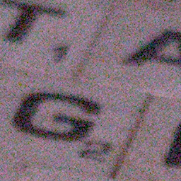
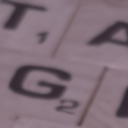
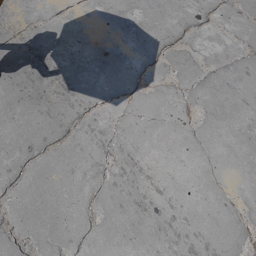
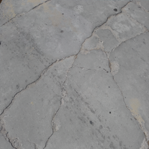
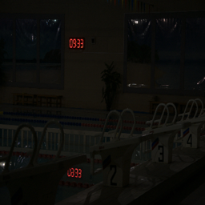
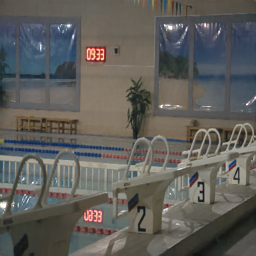
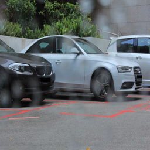
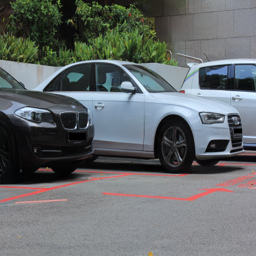

# ILDS-mian
code of Diffusion Model-Based Image Restoration: Integrative Learning of Determinism and Stochasticity.

More code will be made available later.

## Experimental Results

### Denoising
   

### Shadow Removal
   

### Low-light enhancement
   

### Deraining
   
